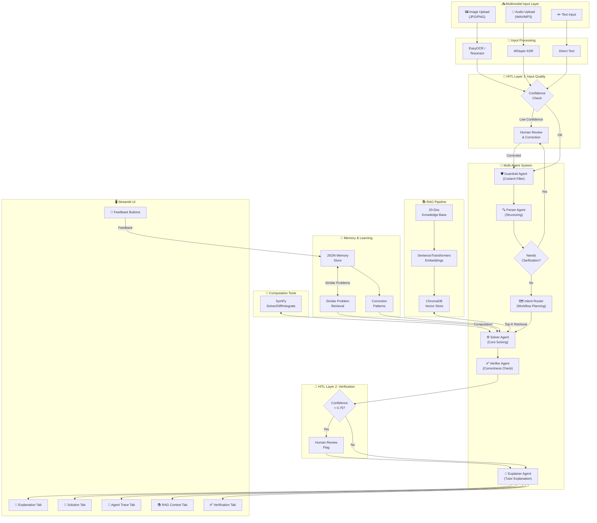

# Math Mentor

A production-grade AI tutoring application for JEE-level mathematics. Accepts image, audio, or typed input; solves problems step-by-step using a multi-agent pipeline backed by RAG and symbolic computation; and improves over time through human feedback and memory.

---

## Table of Contents

1. [Feature Overview](#feature-overview)
2. [Architecture](#architecture)
3. [Project Structure](#project-structure)
4. [Prerequisites](#prerequisites)
5. [Installation](#installation)
6. [Configuration](#configuration)
7. [Running the App](#running-the-app)
8. [Usage Guide](#usage-guide)
9. [Deployment](#deployment)
10. [System Design Details](#system-design-details)
11. [Troubleshooting](#troubleshooting)
12. [Configuration Reference](#configuration-reference)

---

## Feature Overview

| Feature | Details |
|---------|---------|
| **Multimodal Input** | Upload JPG/PNG images (OCR), WAV/MP3 audio (Whisper ASR), or type directly |
| **Multi-Agent System** | 6 agents: Guardrail → Parser → Intent Router → Solver → Verifier → Explainer |
| **RAG Pipeline** | 20-document knowledge base, ChromaDB vector store, sentence-transformers embeddings |
| **Symbolic Computation** | SymPy for exact algebra, calculus (diff/integrate/limits), matrix ops |
| **Human-in-the-Loop** | Triggers on low OCR/ASR confidence, ambiguous parsing, or low verifier confidence |
| **Memory & Learning** | JSON-based memory stores sessions and corrections; reused at solve time |
| **Two LLM Backends** | Anthropic Claude or OpenAI GPT-4 — switch via config |
| **Full UI** | Streamlit app with agent trace, RAG context panel, verification tab, feedback buttons |

**Math scope:** Algebra, Probability, Basic Calculus (limits, derivatives, optimization), Linear Algebra basics — JEE difficulty.

---

## Architecture



---

## Project Structure

```
math_mentor/
│
├── app.py                    # Main Streamlit application (UI + orchestration)
├── config.py                 # Centralized config (reads from .env)
├── requirements.txt          # All Python dependencies
├── .env.example              # Template for environment variables
├── test_core.py              # Quick smoke test for all components
├── architecture.mermaid      # Architecture diagram source
│
├── agents/
│   ├── __init__.py
│   └── agents.py             # All 6 agents + AgentOrchestrator
│
├── rag/
│   ├── __init__.py
│   └── rag_pipeline.py       # Embedding, ChromaDB, retrieval, 20 knowledge docs
│
├── memory/
│   ├── __init__.py
│   └── memory_store.py       # JSON persistent memory + self-learning
│
├── utils/
│   ├── __init__.py
│   ├── llm_client.py         # Unified LLM wrapper (Anthropic + OpenAI)
│   ├── ocr.py                # Image OCR (EasyOCR + Tesseract fallback)
│   ├── asr.py                # Audio transcription (Whisper) + math normalization
│   └── math_tools.py         # SymPy: solve, diff, integrate, limits, matrix ops
│
└── data/                     # Auto-created at runtime
    ├── chroma_db/            # Persisted ChromaDB vector store
    └── memory.json           # Persisted memory store
```

---

## Prerequisites

- **Python 3.9 or higher** (3.10/3.11 recommended)
- **pip** package manager
- **API key** 
- **Optional:** [Tesseract OCR](https://github.com/tesseract-ocr/tesseract) binary (if using tesseract engine)

---

## Installation

### Step 1 — Clone the repository

```bash
git clone https://github.com/YOUR_USERNAME/math-mentor.git
cd math-mentor
```

### Step 2 — Create a virtual environment

```bash
python -m venv venv

# Activate — macOS / Linux:
source venv/bin/activate

# Activate — Windows:
venv\Scripts\activate
```

### Step 3 — Install Python dependencies

**Full installation (all features including OCR and audio):**
```bash
pip install -r requirements.txt
```

**Lightweight installation (text input only — much faster):**
```bash
pip install streamlit anthropic chromadb sentence-transformers sympy python-dotenv pydantic openai
```

> **Dependency sizes to be aware of:**
> - `torch` (~800 MB) — pulled in by EasyOCR and Whisper
> - `easyocr` — needed for image input
> - `openai-whisper` — needed for audio input
> - `sentence-transformers` (~90 MB) — needed for RAG
>
> If you only need text input, the lightweight installation above skips torch entirely.

### Step 4 — Install Tesseract (optional, for image mode)

Tesseract is only needed if you set `OCR_ENGINE=tesseract` or `OCR_ENGINE=both`. EasyOCR (the default) works without it.

**macOS:**
```bash
brew install tesseract
```

**Ubuntu / Debian:**
```bash
sudo apt-get update && sudo apt-get install tesseract-ocr tesseract-ocr-eng
```

**Windows:**
Download the installer from:
https://github.com/UB-Mannheim/tesseract/wiki

After installing, find the path to `tesseract.exe` and set `TESSERACT_CMD` in your `.env` file.

### Step 5 — Configure environment variables

```bash
cp .env.example .env
```

Open `.env` in any text editor and fill in your API key at minimum:

Full configuration reference is at the bottom of this document.

---

## Configuration

The `.env` file controls all runtime behaviour. The most important variables:

```env
# Which LLM to use
LLM_PROVIDER=#           
LLM_MODEL=#        # model name

# Which OCR engine
OCR_ENGINE=easyocr               # easyocr | tesseract | both

# Whisper model size (bigger = more accurate but slower)
WHISPER_MODEL=base               # tiny | base | small | medium

# HITL thresholds — lower = trigger human review more often
OCR_CONFIDENCE_THRESHOLD=0.6
ASR_CONFIDENCE_THRESHOLD=0.7
VERIFIER_CONFIDENCE_THRESHOLD=0.75
```

---

## Running the App

### Verify components first (optional but recommended)

```bash
python test_core.py
```

Expected output:
```
[1] Testing Config...         ✅
[2] Testing Math Tools...     ✅
[3] Testing Memory Store...   ✅
[4] Testing LLM Client...     ✅
[5] Testing RAG Fallback...   ✅
[6] Testing Agent Imports...  ✅
```

### Start the Streamlit app

```bash
streamlit run app.py
```

The app opens at: **http://localhost:8501**

The first startup may take 30–60 seconds as sentence-transformers downloads its model (~90 MB) and ChromaDB indexes the knowledge base.

### Custom port

```bash
streamlit run app.py --server.port 8080
```

---

## Usage Guide

### Text input

1. Select **Text** mode in the radio buttons at the top
2. Type your math problem, or pick one from the **sample problems** dropdown
3. Click **Solve Problem**
4. Results appear in five tabs (see below)

**Example problems you can type:**
```
Solve: 2x² - 5x + 3 = 0
Find d/dx of x³·sin(x)
lim(x→0) sin(3x) / (2x)
P(both aces) when drawing 2 cards from 52
Evaluate ∫(x² + 3x)dx from 0 to 2
Find eigenvalues of [[2,1],[1,2]]
```

### Image input

1. Select **Image (OCR)** mode
2. Click **Browse files** and upload a JPG or PNG of your problem
3. Click **Extract Text from Image**
4. Review the extracted text — edit it if needed
   - If OCR confidence is below 0.6, a yellow **HITL warning** appears automatically
5. Click **Confirm Text**
6. Click **Solve Problem**

**Tips for good OCR:**
- Use high contrast (dark ink on white paper)
- Keep the image upright
- Minimum ~800px wide
- Avoid shadows across the text

### Audio input

1. Select **Audio (ASR)** mode
2. Upload a WAV, MP3, M4A, or OGG file
3. Click **Transcribe Audio**
4. Review the transcript and correct any errors
   - Math phrases are auto-normalized: "square root of 16" → "√16", "x raised to the power 2" → "x^2"
5. Click **Confirm Transcript**
6. Click **Solve Problem**

### Reading results

Results are shown in five tabs:

| Tab | Contents |
|-----|---------|
| **Explanation** | Concept overview, numbered steps with rationale, key formulas, common mistakes, final answer |
| **Full Solution** | Complete unformatted solution text, SymPy tool output if used |
| **Agent Trace** | Expandable card for each agent showing its input, decision, and output |
| **Retrieved Context** | Knowledge chunks retrieved from the vector store with relevance scores |
| **Verification** | Verifier confidence score, issues found, domain checks, HITL flag if triggered |

### Providing feedback

After every solution, a feedback row appears:

- **✅ Correct!** — marks the session as verified; solution pattern is stored in memory and reused for similar future problems
- **❌ Incorrect** — opens a text box; your correction is stored as a learning signal and injected into the Solver context for similar problems going forward

---

## Deployment

### Streamlit Cloud (free, recommended)

1. Push this repository to GitHub
2. Go to https://share.streamlit.io and sign in with GitHub
3. Click **New app** → select your repo, branch `main`, file `app.py`
4. Open **Advanced settings → Secrets** and add:
   ```toml
   ANTHROPIC_API_KEY = "sk-ant-xxxx"
   LLM_PROVIDER = "anthropic"
   LLM_MODEL = "claude-opus-4-5"
   ```
5. Click **Deploy**

> Note: Streamlit Cloud has an ephemeral filesystem. Memory and ChromaDB data will reset on each restart. For persistence, replace the JSON memory store with a cloud database (e.g., Supabase, PlanetScale).

### HuggingFace Spaces

1. Create a new Space at https://huggingface.co/spaces
2. Select **Streamlit** as the SDK
3. Upload all project files or connect your GitHub repo
4. In **Settings → Repository secrets**, add your API key variables
5. The Space will build and deploy automatically

### Railway

1. Create an account at https://railway.app
2. New Project → Deploy from GitHub repo
3. Add environment variables in the Railway dashboard
4. Set the start command:
   ```
   streamlit run app.py --server.port $PORT --server.address 0.0.0.0
   ```

### Render

1. New Web Service → connect GitHub repo
2. Build command: `pip install -r requirements.txt`
3. Start command: `streamlit run app.py --server.port $PORT --server.address 0.0.0.0`
4. Add environment variables in the Render dashboard

---

## System Design Details

### Multi-Agent Pipeline

The six agents run sequentially via `AgentOrchestrator.run_pipeline()`:

```
Guardrail → Parser → Intent Router → Solver → Verifier → Explainer
```

**Guardrail Agent**
Validates that the input is a math problem appropriate for a tutoring app. Returns early with an error if not.

**Parser Agent**
Cleans OCR/ASR artifacts, identifies topic and sub-topic, extracts variables and constraints, sets `needs_clarification` if the problem is ambiguous.

**Intent Router Agent**
Determines which SymPy tools to invoke, sets the RAG topic filter, and queries memory for similar past problems.

**Solver Agent**
Retrieves top-k chunks from ChromaDB, runs applicable SymPy tools, injects memory context (similar problems + correction patterns), then calls the LLM for a full step-by-step solution.

**Verifier Agent**
Critically reviews the solution for arithmetic errors, domain violations, missing cases, and formula errors. Returns a confidence score; sets `needs_human_review = true` if confidence < threshold.

**Explainer Agent**
Transforms the verified solution into a structured, student-friendly explanation with numbered steps, formula references, common mistakes, and a memory tip.

### RAG Pipeline

- **Knowledge base:** 20 curated documents covering all four topic areas. Each document contains definitions, formulas, worked patterns, and JEE-specific tips.
- **Embedding:** `all-MiniLM-L6-v2` via sentence-transformers (runs locally, no API call).
- **Vector store:** ChromaDB persisted to `./data/chroma_db/`. First run indexes all 20 docs; subsequent runs load from disk.
- **Retrieval:** Cosine similarity search, top-4 chunks. Topic filter applied when topic is identified.
- **Fallback:** If ChromaDB is unavailable, keyword overlap scoring is used instead.

### HITL Triggers

| Trigger | Condition | User Action |
|---------|-----------|-------------|
| Low OCR confidence | `ocr_confidence < OCR_CONFIDENCE_THRESHOLD` | Edit extracted text, confirm |
| Low ASR confidence | `asr_confidence < ASR_CONFIDENCE_THRESHOLD` | Edit transcript, confirm |
| Parser ambiguity | `needs_clarification == true` | Clarify problem, resubmit |
| Low verifier confidence | `confidence < VERIFIER_CONFIDENCE_THRESHOLD` | Warning shown; user reviews solution |
| Explicit user correction | User clicks Incorrect | Provide correct answer |

### Memory System

Every solved session stores: raw input, parsed problem, retrieved chunks, solution text, verifier output, and user feedback.

At solve time, the Intent Router queries memory for similar problems (keyword overlap, filtered by topic). The Solver Agent receives:
- Top-2 similar past solutions (if any)
- Recent correction patterns for the same topic (last 10)

This creates a feedback loop: wrong answers that users correct are used to guide future solves away from the same mistakes — without any model retraining.

---

## Troubleshooting

**`LLM call failed` error**
→ Check that `ANTHROPIC_API_KEY` or `OPENAI_API_KEY` is set in `.env` and that it starts with the correct prefix (`sk-ant-` for Anthropic, `sk-` for OpenAI).

**Blank OCR result**
→ Install EasyOCR: `pip install easyocr`. On first use it downloads model files (~200 MB). If that fails, set `OCR_ENGINE=tesseract` and install Tesseract binary.

**`Whisper not installed`**
→ Run: `pip install openai-whisper`. This also requires `torch`.

**`chromadb` import errors**
→ Upgrade: `pip install chromadb --upgrade`. If persisted data is corrupt, delete `./data/chroma_db/` and restart.

**Slow first startup**
→ sentence-transformers downloads `all-MiniLM-L6-v2` (~90 MB) on first use. Subsequent startups are fast because the model is cached.

**Out of memory on low-RAM machines**
→ Set `WHISPER_MODEL=tiny` in `.env`. Avoid running OCR and audio at the same time.

**`ModuleNotFoundError: No module named 'utils'`**
→ Run `streamlit run app.py` from the `math_mentor/` directory, not from a parent directory.

**ChromaDB `InvalidDimensionException`**
→ The embedding dimension changed. Delete `./data/chroma_db/` and restart to re-index.

---

## Configuration Reference

| Variable | Default | Description |
|----------|---------|-------------|
| `ANTHROPIC_API_KEY` | — | Anthropic Claude API key |
| `OPENAI_API_KEY` | — | OpenAI API key |
| `LLM_PROVIDER` | `anthropic` | `anthropic` or `openai` |
| `LLM_MODEL` | `claude-opus-4-5` | Model identifier |
| `EMBEDDING_MODEL` | `all-MiniLM-L6-v2` | Sentence-transformers model |
| `CHROMA_PERSIST_DIR` | `./data/chroma_db` | ChromaDB storage path |
| `MEMORY_DB_PATH` | `./data/memory.json` | Memory store path |
| `OCR_ENGINE` | `easyocr` | `easyocr`, `tesseract`, or `both` |
| `TESSERACT_CMD` | `/usr/bin/tesseract` | Path to tesseract binary |
| `WHISPER_MODEL` | `base` | `tiny`, `base`, `small`, `medium` |
| `OCR_CONFIDENCE_THRESHOLD` | `0.6` | HITL trigger for OCR |
| `ASR_CONFIDENCE_THRESHOLD` | `0.7` | HITL trigger for audio |
| `VERIFIER_CONFIDENCE_THRESHOLD` | `0.75` | HITL trigger for verification |
| `DEBUG_MODE` | `false` | Show extra debug info |

